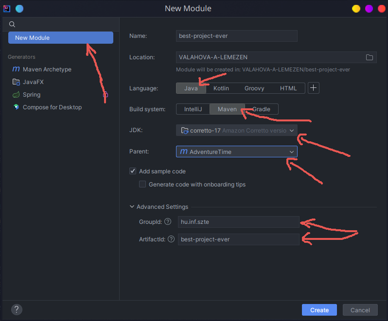

# Project Adventure Time

A következő anyagrészek során Java servletekkel ismerkedhetünk meg. Itt fogunk némi betekintést nyerni abba,
hogy hogyan is rakhatunk össze egy egyszerűbb webes API-t. Modernebb rendszerek használata esetén, mint pl. egy
[Spring Boot Web MVC Framework](https://docs.spring.io/spring-boot/docs/current/reference/html/web.html), már sok itt
látott dolog automatizálható, és nem kell foglalkozzunk vele, azonban ahhoz, hogy nagyjából megérthessük mi történik
ott, ahhoz nem árt egy kicsit alacsonyabb szintű rendszerekkel is foglalkozni egy rövid ideig.

Eddigi projektünket követve egy utazások és látnivalók felvételére készült alkalmazás fogunk elkészíteni.

## Packing

Webes alkalmazás esetén ügyeljünk rá, hogy az alkalmazásunk `war` csomagolási kiterjesztésű legyen.
Ezt a projektünk pom fájljában adhatjuk meg a következő módon:

```xml
<packaging>war</packaging>
```

ahol war = Web Application Archive.

Mivel jelenlegi alkalmazásunk egy annak megfelelő _servlet_ konténerben fog futni,
így ennek megfelelő csomagolást választunk neki, ez a war.

A [<packing\/> tag](https://maven.apache.org/pom.html#packaging)-et ugyanarra a szintre kell elhelyezzük,
mint akár a `<groupId/>`-t, vagy az `<artifactId>`-t.
További referenciákért bátran látogassunk el a https://maven.apache.org/pom.html oldalra.

## Projekt kezdése

Több mint valószínű, hogy sok-sok kiindulási template közül választhatnánk, mikor új webes projektet kezdünk,
viszont ezek többsége mára már sajnos vagy függőség, vagy webtechnológia szintjén elavultabbá vált, így
itt most egyiket sem fogjuk választani, összeszedjük magunknak, ami kell.

Webes applikációnkhoz készítsünk egy lehetőleg elkülönülő modult a következőképpen:



Fontos, hogy válasszuk ki a megfelelő `Parent` attribútumot, valamint a `groupId`-t is úgy válasszuk meg, hogy az
egyezzen a szülő package group azonosítójával (ha jót akarunk).

## Servlet konténer

Jelen használt servlet konténerünk egy egyszerű [Apache Tomcat](https://tomcat.apache.org/whichversion.html) lesz.
Röviden, egy olyan szoftverről van szó, amely
a [Jakarta EE platform](https://projects.eclipse.org/projects/ee4j.jakartaee-platform)
által specifikált eszközhalmaz egy minimális részét implementálja/tartalmazza.
Erre majd a későbbiek során vissza térünk egy rövid pillanatra, de most elegendő egy rövid kitérőként tekinteni erre.

Fontosak lehetnek azonban a fenti linken található verziózások! Ha fejlesztés során olyan hibákkal találkozunk
futtatás közben, mint pl. egy `ClassNotFoundException`, akkor gondolhatunk arra, hogy talán elcsúsztunk a verziókkal.
Nagyon erős indikátor lehet erre a hibára, amennyiben implementációnk `javax.*` csomagokat használ, miközben a `tomcat`
verziónk pl. `==10.x`. Ebben az esetben ugyanis a tomcat implementáció már `jakarta.*` és NEM `javax.*` csomagokat keres.
De erről a fenti linkeken többet olvashatunk.

| Servlet Spec | JSP Spec | EL Spec | WebSocket Spec | Authentication (JASPIC) Spec | Apache Tomcat Version | Latest Released Version | Supported Java Versions                 |
|--------------|----------|---------|----------------|------------------------------|-----------------------|-------------------------|-----------------------------------------|
| 6.1          | 4.0      | 6.0     | 2.2            | 3.1                          | 11.0.x                | 11.0.0-M18 (alpha)      | 17 and later                            |
| 6.0          | 3.1      | 5.0     | 2.1            | 3.0                          | 10.1.x                | 10.1.20                 | 11 and later                            |
| 5.0          | 3.0      | 4.0     | 2.0            | 2.0                          | 10.0.x (superseded)   | 10.0.27 (superseded)    | 8 and later                             |
| 4.0          | 2.3      | 3.0     | 1.1            | 1.1                          | 9.0.x                 | 9.0.87                  | 8 and later                             |
| 3.1          | 2.3      | 3.0     | 1.1            | 1.1                          | 8.5.x                 | 8.5.100                 | 7 and later                             |
| 3.1          | 2.3      | 3.0     | 1.1            | N/A                          | 8.0.x (superseded)    | 8.0.53 (superseded)     | 7 and later                             |
| 3.0          | 2.2      | 2.2     | 1.1            | N/A                          | 7.0.x (archived)      | 7.0.109 (archived)      | 6 and later (7 and later for WebSocket) |
| 2.5          | 2.1      | 2.1     | N/A            | N/A                          | 6.0.x (archived)      | 6.0.53 (archived)       | 5 and later                             |
| 2.4          | 2.0      | N/A     | N/A            | N/A                          | 5.5.x (archived)      | 5.5.36 (archived)       | 1.4 and later                           |
| 2.3          | 1.2      | N/A     | N/A            | N/A                          | 4.1.x (archived)      | 4.1.40 (archived)       | 1.3 and later                           |
| 2.2          | 1.1      | N/A     | N/A            | N/A                          | 3.3.x (archived)      | 3.3.2 (archived)        | 1.1 and later                           |

A felhasználhatóság kedvéért a linken található táblázat itt is megjelenik, ám ezt csak óvatosan használjuk!
Az írás pillanatában a `Tomcat 11.x`-es szoftver még erősen fejlesztés alatt áll, ezért a specifikációk változhatnak,
míg az itt található táblázat nem feltétlenül fog!

Ahhoz, hogy legyen egy ilyen konténerünk, többféleképpen is eljárhatunk.
Régebbi gyakorlatokhoz hasonlóan segíthet ebben egy elég széleskörűen használt plugin,
amely egy beágyazott `tomcat` szervert fog futtatni számunkra.

```xml
<plugin>
    <groupId>org.codehaus.cargo</groupId>
    <artifactId>cargo-maven3-plugin</artifactId>
    <configuration>
        <!-- most egy beágyazott, v10 tomcat-et használunk -->
        <container>
            <containerId>tomcat10x</containerId>
            <type>embedded</type>
        </container>
        <configuration>
            <properties>
                <!-- fusson a 8080-as porton! -->
                <cargo.servlet.port>8080</cargo.servlet.port>
                <!-- low, medium vagy high -->
                <cargo.logging>medium</cargo.logging>
            </properties>
        </configuration>
        <deployables>
            <deployable>
                <groupId>${project.groupId}</groupId>
                <artifactId>${project.artifactId}</artifactId>
                <type>${project.packaging}</type>
                <properties>
                    <!-- ez azért jó, mert így nem lesz mindenféle default útvonal beállítva -->
                    <context>/</context>
                </properties>
            </deployable>
        </deployables>
    </configuration>
</plugin>
```

Nincs szükség külön tomcat szerver telepítésére, mára már teljesen jó és kijárt utak vannak standalone
_webservice_-k készítésére. A gyakorlat során valószínűleg ez elegendő, és kényelmesebb is lehet.
Amennyiben életutunk során szükségünk lenne egy külső szerverre való alkalmazás deploy-ra, úgy
ellátogathatunk a régi gyakorlati részekhez.

Pluginok használatára már láttunk példát, evvel is hasonlóképp futtathatjuk alkalmazásunkat,
mint egy `javafx` alkalmazás esetén.

```bash
./mvnw cargo:run
```

avagy a projekten belül:

```bash
./mvnw install && ./mvnw cargo:run -pl webapi
```

parancs segítségével futtathatjuk.

Térjünk rá ezután egy könnyebb útra, az alkalmazásunk indításához. Itt megjegyezzük,
hogy ezen gyakorlatnak nem célja megismertetni a Spring Framework-öt, és annak csodáit,
viszont a webapplikációnk indításához egy igen kellemes eszköz lehet.

```java
@ServletComponentScan
@SpringBootApplication
@EnableAutoConfiguration
public class App {

    public static void main(String[] args) {
        new SpringApplication(App.class).run(args);
    }
}
```

Egy ilyen - effektíve egy soros - `Main` class segítségével bármely számunkra kedves IDE
használatával is indíthatjuk alkalmazásunkat.

```xml
<dependency>
    <groupId>org.springframework.boot</groupId>
    <artifactId>spring-boot-starter-web</artifactId>
    <version>3.2.4</version>
</dependency>
<dependency>
    <groupId>org.apache.tomcat.embed</groupId>
    <artifactId>tomcat-embed-core</artifactId>
    <version>10.1.20</version>
</dependency>
```

Ehhez erre a két függőségre van szükségünk. Az elsőre a Spring Boot miatt, a másodikra a beágyazott Tomcat
szerver miatt, melyet a keretrendszerünk ebben az esetben elindít számunkra. Egy beágyazott Tomcat szerver
indítása nem túl veszélyes feladat, viszont jelenlegi gyakorlati anyagunk erre most nem terjed ki,
így marad a plugin, vagy egy Spring Boot.

## Modellek

A teljesség igénye nélkül, itt most megjelenítünk egy pár megvalósítás szempontjából fontosabb
modell osztályt, melyek szükségesek lehetnek az API pontokkal való kommunikációhoz.

A konkrét utazások reprezentációjára szolgáló objektumok:

[Sight.java](./core/src/main/java/hu/inf/szte/adventure/model/Sight.java)

```java
@NoArgsConstructor
@AllArgsConstructor
@Getter
@Setter
@ToString
public class Sight {

    private Long id;
    private String name;
    private BigDecimal price;
    private Integer openingHour;
    private Integer closingHour;
    private String description;
    private Integer popularity;
}
```

---

Egy create operáció után adott válasz formátuma:

[InsertId.java](./core/src/main/java/hu/inf/szte/adventure/model/InsertId.java)

```java
public record InsertId(Object id) {
}
```

---

Ebben az esetben az `Object`, mint ID minden esetben `Long` típusú lesz, de meghagytuk a lehetőséget
esetlegesen más típusú elsődleges kulcsoknak is.

---

Adatbázis módosítás után adott válasz (Update, vagy Delete).

[ModifiedRows.java](./core/src/main/java/hu/inf/szte/adventure/model/ModifiedRows.java)

```java
public record ModifiedRows(int affectedRows) {
}
```

---

Egyes preferenciák beállítására szolgáló kérés formátuma.

[Preferences.java](./core/src/main/java/hu/inf/szte/adventure/model/Preferences.java)

```java
public record Preferences(
        BigDecimal minPrice,
        BigDecimal maxPrice,
        Integer minPopularity) implements Serializable {
}
```

---

[Message.java](./core/src/main/java/hu/inf/szte/adventure/model/Message.java)

```java
public record Message(String message) {
}
```

## Servletek

A Java Servletek valamilyen féle alkalmazás-szerveren futó programok, melyeket egy köztes rétegként képzelhetünk el
kliensek kérései (pl. HTTP), valamint alkalmazásunk/alkalmazásaink között.

Servleteink során a következő `import`-okat szinte biztosan használni fogjuk:

```java
import jakarta.servlet.ServletConfig;
import jakarta.servlet.annotation.WebServlet;
import jakarta.servlet.http.HttpServlet;
import jakarta.servlet.http.HttpServletRequest;
import jakarta.servlet.http.HttpServletResponse;
```

Ők a következő függőségtől származnak:

```xml
<dependency>
    <groupId>jakarta.servlet</groupId>
    <artifactId>jakarta.servlet-api</artifactId>
    <version>6.0.0</version>
    <!-- Figyeljük meg a függőség scope-ját! -->
    <scope>provided</scope>
</dependency>
```

Ennél a pontnál kalandozzunk vissza az előző részek [tartalmához](#servlet-konténer).
Említettük, hogy az alkalmazásunkat futtató servlet konténer (jelenleg Tomcat) implementál
bizonyos specifikációkat. Adott konténer kiválasztása esetén a fejlesztő felelőssége,
hogy utánajárjon annak, hogy a Jakarta EE specifikációk közül melyek azok, amelyeket
tartalmaz a választott szoftver.
A provided scope annyit mond most itt nekünk, hogy az evvel járó csomagokat elegendő
fordítási időben behúzni, ugyanis ez majd a futás során valahonnan elérhető lesz. Ez
a valahonnan jelenleg a Tomcat szoftvertől lesz, ő fogja biztosítani nekünk a szükséges
jakarta osztályokat.

Kezdetben vegyük például egy egyszerű servlet elkészítését.

### Teapot

Egy teás kanna!

[TeapotServlet.java](./webapi/src/main/java/hu/inf/szte/adventure/servlet/TeapotServlet.java)

```java
// Ez egy fontos annotáció, ugyanis ennek segítségével
// specifikálhatjuk, hogy milyen útvonalon fog élni az
// adott servletünk. Ha a HOST után, (bármely kedvenc
// http kliensünket (vagy itt most épp akár böngészőnket)
// használva) az itt leírt útvonalat adjuk meg, akkor ez
// a servlet fog reagálni a kéréseinkre.
@WebServlet(urlPatterns = "/teapot")
// Az is nagyon fontos továbbá, hogy osztályunk a HttpServlet
// class-ból öröklődjön.
public class TeapotServlet extends HttpServlet {

    // Itt a GET kérésekre való reagálási hajlamát adhatjuk meg
    @Override
    protected void doGet(HttpServletRequest req, HttpServletResponse resp) throws IOException {
        // Megadjuk a válasz formátumát. Most pl. text/html, de
        // ebben az esetben lehetne text/plain is. Van még jó sok,
        // nézzük meg őket!
        resp.setContentType(ContentType.TEXT_HTML.getMimeType());
        // Nem kötelező, de specifikálhatjuk a karakter kódolást is.
        resp.setCharacterEncoding(StandardCharsets.UTF_8.name());

        // Itt ez most egy teapot status. Általában OK == 200,
        // vagy hasonlókat fogunk inkább látni.
        // https://developer.mozilla.org/en-US/docs/Web/HTTP/Status/418
        resp.setStatus(418);  // Nincs beépített teapot válasz :(
        // megfogjuk a response writer-t
        // aztán írunk vele valami választ
        // most csak annyit, hogy teapot vagyok
        resp.getWriter().println("I am a teapot");
    }
}
```

A gyakorlat során főként [POST](https://developer.mozilla.org/en-US/docs/Web/HTTP/Methods/POST) kérésekkel fogunk
foglalkozni. Bizonyos esetekben akár használhatnánk [GET](https://developer.mozilla.org/en-US/docs/Web/HTTP/Methods/GET)
kéréseket is, azonban nem igazán akarunk olyan kéréseket tervezni, melyeknek fontos lenne a cache-elése, továbbá
amennyiben kiegészítenénk az alkalmazásunkat olyan módon, hogy az valamilyen féle autentikációt is tartalmazzon,
úgy megint csak oda jutnánk, hogy az egyes API endpoint-okat `POST` kérésekkel kellene megvalósítsuk.

Ilyen módon diplomatikusabb tehát, ha maradunk a `POST` kéréseknél.
A fenti egyszerű esetben viszont, mivel olyanféle _view_ adatokat közlünk a klienssel,
így már inkább indokolt egy `GET` request használata.

---

#### Request

És hogy ezt hogyan is érjük el? Próbáljuk ki először egy kissé fapados módon!
A következőkben, és itt is feltételezzük, hogy az alkalmazásunk a 8080-as porton fut.

Példa cURL segítségével a teapot servlet-hez:

```bash
curl http://localhost:8080/teapot
```

ugyanez fetch api használatával:

```javascript
fetch("http://localhost:8080/teapot"
).then(resp => {
  return resp.text();
}).then(data => {
  console.log(data);
})
```

### Read

Készítsük el elsőre a feladatunkhoz tartozó első servletként, a read servletet.
Őt arra fogjuk használni, hogy az éppen megvalósított perzisztens tárhelytől adatokat kérjünk le.
Mint a többi servlet megvalósítását, ezt is érdemes egy külön, pl. `servlet` csomag alá helyezni.

[SightReadServlet.java](./webapi/src/main/java/hu/inf/szte/adventure/servlet/SightReadServlet.java)

```java
// Jelen servletünk több URL-t is elfogad, read és list alias alatt is hívhatjuk.
@WebServlet(urlPatterns = {"/api/sight/read", "/api/sight/list"})
public class SightReadServlet extends HttpServlet {

    // data access object, mellyel az utazásainkat kezelhetjük
    private Dao<Long, Sight> dao;
    // opcionális
    // validációra szolgáló factory, mely validációt kézzel is elvégezhetünk
    private ValidatorFactory validatorFactory;
    // egy opcionális logger
    // nem feltétele egy működő servletnek
    private final Logger logger = LoggerFactory.getLogger(getClass());

    // Az init metódus most nekünk csak a DataSource beszerzése miatt fontos,
    // azonban ebben a példában itt most található egy validátor is.
    @Override
    public void init(ServletConfig config) {
        // Honnan jön ez itt??? Később látni fogjuk!
        // Itt természetesen elegendő lehetne egy singleton-tól elkérni ezt,
        // de ha hosszútávon jót akarunk magunknak, akkor singleton-t csak akkor
        // alkalmazunk ha abszolút muszáj, vagy indokolt.
        var dataSource = (DataSource) config.getServletContext().getAttribute("ds");
        dao = new SightJooqDao(dataSource, SQLDialect.SQLITE);
        validatorFactory = (ValidatorFactory) config.getServletContext().getAttribute("val");
    }

    @Override
    protected void doPost(HttpServletRequest req, HttpServletResponse resp) throws IOException {
        // Adott metódusaink belépésekor rögtön specifikálhatjuk is a válaszunk formátumát!
        resp.setContentType(ContentType.APPLICATION_JSON.getMimeType());
        // állíthatunk karakter kódolást is --> pl. UTF-8
        resp.setCharacterEncoding(StandardCharsets.UTF_8.name());
        // Az alap státusz kódunk egy OK (200) lesz.
        resp.setStatus(HttpStatus.SC_OK);

        // kérünk egy json szerializáló példányt
        var gson = JsonSupport.create();
        // beolvassuk a request body-t
        var reqModel = gson.fromJson(req.getReader(), ReadSightReq.class);
        var validator = validatorFactory.getValidator();
        Set<ConstraintViolation<ReadSightReq>> valResult = new HashSet<>();
        // amennyiben van request model, úgy validáljuk azt
        if (reqModel != null) {
            valResult = validator.validate(reqModel);
        }

        // opcionális: logolás
        valResult.forEach(el -> logger.error(ValidationLog.createLog(el)));
        // Amennyiben a validáció hibába, vagy hibákba ütközött, abban az esetben
        // szeretnénk ha a servlet pl. egy BAD_REQUEST (400) hibakóddal jelezné
        // problémáját. Amennyiben módunk van rá adhatunk némi információt is evvel
        // kapcsolatban, pl. egy error message formájában.
        if (!valResult.isEmpty()) {
            resp.setStatus(HttpStatus.SC_BAD_REQUEST);
            resp.getWriter().println(gson.toJson(new Error(valResult.stream()
                    .map(ValidationLog::createLog)
                    .collect(Collectors.joining("\n")))));
            return;
        }

        // Ha a kérés üres volt, akkor csak szimplán lekérjük az összes rekordot,
        Iterable<Sight> models;
        if (reqModel == null) {
            models = dao.findAll();
        }
        // máskülönben pedig szűrünk az adott kérésben szereplő modell szerint.
        else {
            models = dao.findAllByCrit(ConversionSupport.toModel(reqModel));
        }
        var modelList = StreamSupport.stream(models.spliterator(), false).toList();
        resp.getWriter().println(gson.toJson(modelList));
    }
}
```

Megvalósított servleteink esetén talán az egyik legfontosabb lépés a válasz írása.
Itt és a következőkben egy egyszerűen használható, és népszerű json parser csomagot használunk:
[gson](https://github.com/google/gson)

További infókért nézzük meg a [JSON](#json-string-kezelés) szekciót.

#### ! Note !


Itt nem győzzük hangsúlyozni, hogy a kért válaszok formátuma nagyon fontos API tervezése esetén.
Amennyiben ez eltér a megrendeléstől, úgy a ráépülő applikációk egyike sem fogja érteni a
szerver által küldött válaszokat, itt nincs "pardon". Ha egy adott API endpoint egy `alma` és
egy `kukac` mezőkkel rendelkező JSON-t vár, pl. `String` és `Integer` típusokat feltételezve,
akkor amennyiben nem olvasható az adott válasz ebben az adott formátumban, úgy az egész mehet a levesbe!

---

#### Request

Példa az összes rekord lekérésére:

```bash
curl --request POST http://localhost:8080/api/sight/list
```

Ugyanez szűréssel:

```bash
curl --header "Content-Type: application/json" --data '{"id": 3}' --request POST http://localhost:8080/api/sight/list
```

Fetch API:

```javascript
fetch("http://localhost:8080/api/sight/list", {
  "method": "post",
  "body": JSON.stringify({"name": "a"}),
  "headers": { "Content-Type": "application/json" }
}).then(
  resp => resp.json()
).then(data => {
  console.log(data);
})
```

### Create

A create servletünk nagyon hasonló alapokra épül, mint akár a read, csupán a `doPost`
megvalósításában lesznek eltérések. Ezen kívül természetesen az is különböző lesz,
hogy milyen url-pattern alatt fogjuk elérni, melyet ne feledjünk el a megfelelő
annotáció segítségével beállítani. Ezen URL-ek esetünkben pl. lehetnek a következők:
`"/api/sight/create"`, `"/api/sight/insert"`, `"/api/sight/add"`

[SightCreateServlet.java](./webapi/src/main/java/hu/inf/szte/adventure/servlet/SightCreateServlet.java)

```java
@Override
private void doPost(HttpServletRequest req, HttpServletResponse resp) throws IOException {
    resp.setContentType(ContentType.APPLICATION_JSON.getMimeType());
    resp.setCharacterEncoding(StandardCharsets.UTF_8.name());
    resp.setStatus(HttpStatus.SC_CREATED);

    var gson = JsonSupport.create();
    // első különbség az elfogadott kérés típusában
    var reqModel = gson.fromJson(req.getReader(), NewSightReq.class);
    var validator = validatorFactory.getValidator();
    var valResult = validator.validate(reqModel);

    valResult.forEach(el -> logger.error(ValidationLog.createLog(el)));
    if (!valResult.isEmpty()) {
        resp.setStatus(HttpStatus.SC_BAD_REQUEST);
        resp.getWriter().println(gson.toJson(new Error(valResult.stream()
                .map(ValidationLog::createLog)
                .collect(Collectors.joining("\n")))));
        return;
    }
    // request modell átalakítása tényleges db modellé
    // gyakorlatilag a mezők megfelelő értékeinek másolása történik
    var dbModel = ConversionSupport.toModel(reqModel);
    // adott model tényleges mentése az adatbázisba
    dao.save(dbModel);
    // json konvertálás -> "{"id": dbModel::id}"
    resp.getWriter().println(gson.toJson(new InsertId(dbModel.getId())));
}
```

Adott esetben akár be is olvashatnánk minden kérést egy adott osztályba, esetünkben a `Sight`
osztályba, azonban vegyük észre, hogy itt most egy `NewSightReq` típust használunk arra, hogy
a kliens kérését beolvassuk. Ez az osztály pl. a következőképpen nézhet ki:

[NewSightReq.java](./webapi/src/main/java/hu/inf/szte/adventure/model/NewSightReq.java)

```java
@NoArgsConstructor
@AllArgsConstructor
@Getter
@Setter
@ToString
public class NewSightReq {

    @NotBlank
    private String name;
    @PositiveOrZero
    @NotNull
    private BigDecimal price;
    @Min(0)
    @Max(23)
    @NotNull
    private Integer openingHour;
    @Min(0)
    @Max(24)
    @NotNull
    private Integer closingHour;
    private String description;
    @Min(0)
    @Max(10)
    @NotNull
    private Integer popularity;
}
```

Itt a `jakarta.validation-api`-t használjuk, mint függőség.

```xml
<dependency>
    <groupId>jakarta.validation</groupId>
    <artifactId>jakarta.validation-api</artifactId>
    <version>3.0.2</version>
</dependency>
```

Tárolásra és kérésre alkalmas osztályainkat nagyon sok esetben érdemes lehet szétválasztani.
Már csak azért is, mert egy kérés során (mint itt is) nem feltétlenül várjuk el ugyanazon
paramétereket. Továbbá a validációja is elkülönülhet annak, hogy mit tekintünk valid inputnak,
valamint annak is, hogy adatbázis mentéskor mit tekintünk egy érvényes rekordnak. Gondoljunk
például csak bele a `UNIQUE` megkötésekre. Ezt bevitelkor nem tudjuk, és nem is akarjuk
ellenőrizni, csupán a tényleges adatbázisba való mentés lépésekor.

---

#### Request

Példa egy create kérésre cURL használatával:

```bash
curl -header "Content-Type: application/json" --data '{"name": "sth new", "price": 93.15, "openingHour": 6, "closingHour": 18, "description": "A long description to show you how good this sight is.\nBe prepared!"; "popularity": 7}' --request POST http://localhost:8080/api/sight/create
```

### Update

Update esetén szinte ugyanaz történik, mint egy create esetén, csupán arra kell figyeljünk, hogy a
megengedett URL-eket ennek a servletnek megfelelően adjuk meg. Pl. `api/sight/update`, és/vagy
`api/sight/refresh` legyen.
Ezen kívül természetesen egy kicsit más, de nagyon hasonló a beolvasott kérés formátuma is, amely
itt most ténylegesen csak annyiban különbözik, hogy az `UpdateSightReq` class tartalmaz egy `id`
mezőt is. Továbbá szükséges még a megfelelő `dao::updateById` metódusát is meghívni.
Válaszunk pedig egy `affectedRows` nevű mezőt tartalmaz, mely a módosított rekordok számosságát
hivatott jelölni.

[SightUpdateServlet.java](./webapi/src/main/java/hu/inf/szte/adventure/servlet/SightUpdateServlet.java)

```java
@Override
private void doPost(HttpServletRequest req, HttpServletResponse resp) throws IOException {
    resp.setContentType(ContentType.APPLICATION_JSON.getMimeType());
    resp.setCharacterEncoding(StandardCharsets.UTF_8.name());
    resp.setStatus(HttpStatus.SC_OK);

    var gson = JsonSupport.create();
    // update request beolvasása
    var reqModel = gson.fromJson(req.getReader(), UpdateSightReq.class);
    var validator = validatorFactory.getValidator();
    var valResult = validator.validate(reqModel);

    valResult.forEach(el -> logger.error(ValidationLog.createLog(el)));
    if (!valResult.isEmpty()) {
        resp.setStatus(HttpStatus.SC_BAD_REQUEST);
        resp.getWriter().println(gson.toJson(new Error(valResult.stream()
                .map(ValidationLog::createLog)
                .collect(Collectors.joining("\n")))));
        return;
    }
    // request modell átalakítása tényleges db modellé
    // gyakorlatilag a mezők megfelelő értékeinek másolása történik
    var dbModel = ConversionSupport.toModel(reqModel);
    // db update
    var affectedRows = dao.updateById(reqModel.getId(), dbModel);
    // majd válasz írása
    resp.getWriter().println(gson.toJson(new ModifiedRows(affectedRows)));
}
```

Láthatjuk, hogy gondosabban megtervezett servletek esetén nagyon minimális változtatás
is elég lehet különböző funkciók megvalósításához. Ugyanakkor, ez jelen pillanatban másra
is adhat utalást. Vegyük észre, hogy ez a servlet, és az előzőek esetén is igaz, hogy
nagyon kevés tényleges funkcionalitással rendelkeznek egy ilyen egyszerű esetben.
Ha nagyon fapadosak akarunk lenni, akkor az egész `doPost` redukálható lenne a következő
_lényegi_ sorokra:

```java
@Override
private void doPost(HttpServletRequest req, HttpServletResponse resp) throws IOException {
    var reqModel = new Gson().fromJson(req.getReader(), UpdateSightReq.class);
    resp.getWriter().println(new Gson().toJson(new ModifiedRows(
            dao.updateById(reqModel.getId(), ConversionSupport.toModel(reqModel)))));
}
```

Ez elmondható a többi servletünkről is. Természetesen fontos a validáció, de ha esetleg hajlamot
éreznénk a részletekben való elveszéshez, akkor gondoljunk csak a fenti megvalósításra.

Gyakorlásképpen, és egy teljesen ideális világot feltételezve, írjuk át az összes eddigi servletet
ilyen módon!

---

### Request

```bash
curl -header "Content-Type: application/json" --data '{"id": 3, "name": "change me", "price": 24.42, "openingHour": 12, "closingHour": 20, "description": "Come here kind Sir!"; "popularity": 8}' --request POST http://localhost:8080/api/sight/update
```

### Delete

Delete esetében nem is időzünk már sokat, ő már tényleg szinte ugyanaz, mint egy update.

[SightDeleteServlet.java](./webapi/src/main/java/hu/inf/szte/adventure/servlet/SightDeleteServlet.java)

```java
@Override
private void doPost(HttpServletRequest req, HttpServletResponse resp) throws IOException {
    resp.setContentType(ContentType.APPLICATION_JSON.getMimeType());
    resp.setCharacterEncoding(StandardCharsets.UTF_8.name());
    resp.setStatus(HttpStatus.SC_OK);

    var gson = JsonSupport.create();
    var reqModel = gson.fromJson(req.getReader(), DeleteSightReq.class);
    var validator = validatorFactory.getValidator();
    var valResult = validator.validate(reqModel);

    valResult.forEach(el -> logger.error(ValidationLog.createLog(el)));
    if (!valResult.isEmpty()) {
        resp.setStatus(HttpStatus.SC_BAD_REQUEST);
        resp.getWriter().println(gson.toJson(new Error(valResult.stream()
                .map(ValidationLog::createLog)
                .collect(Collectors.joining("\n")))));
        return;
    }
    var affectedRows = dao.deleteById(reqModel.getId());
    resp.getWriter().println(gson.toJson(new ModifiedRows(affectedRows)));
}
```

---

### Request

```bash
curl -header "Content-Type: application/json" --data '{"id": 3}' --request POST http://localhost:8080/api/sight/delete
```

## Servlet context

Történetünk elején láthattuk, hogy kaptunk egy pár ingyen `DataSource`, valamint
`ValidatorFactory` objektumot is. De honnan is jöttek ezek? Applikációnk indulásakor van
egy fontos event, melyre listener-t is köthetünk Ez pedig a
[ServletContextListener::contextInitialized](https://www.geeksforgeeks.org/servlet-context-event-and-context-listener/)
event. Egyéb event listenerekkel a gyakorlat során valószínűleg nem fogunk találkozni, de
röviden feladatuk annyiban ki is merül, hogy megfelelő eventekre specifikálhatunk velük egy
adott munkavégzési folyamatot. Azaz, "ha jön egy ilyen _event_, akkor hajtsd végre ezt az _action_-t".

Egy ilyen listener-t például a következőképpen implementálhatunk:

[ContextListener.java](./webapi/src/main/java/hu/inf/szte/adventure/listener/ContextListener.java)

```java
@WebListener
public class ContextListener implements ServletContextListener {

    // ő lesz majd a DataSource objektumunk az alkalmazásunk pusztulásáig
    private final DataSource dataSource;
    // szintén az alkalmazásunk végéig él, és a requestek validálásáért szolgál
    private final ValidatorFactory validatorFactory;

    public ContextListener() {
        // final mezők létrehozása
        dataSource = new DataSourceFactory().getDataSource();
        validatorFactory = Validation.buildDefaultValidatorFactory();
    }

    @Override
    public void contextInitialized(ServletContextEvent sce) {
        var dbSupport = new SqlDbSupport(dataSource);
        //var authSupport = new CookieAuthSupport(new AuthService(new UserJooqDao(dataSource, SQLDialect.SQLITE)), null, null);
        var authSupport = new NopAuthenticator();
        // inicializálunk minden "globális" változót, ami csak kell
        // ezeket majd BÁRMELY servlet-ből elérhetjük
        sce.getServletContext().setAttribute("ds", dataSource);
        sce.getServletContext().setAttribute("auth", authSupport);
        sce.getServletContext().setAttribute("val", validatorFactory);
        // memory db init
        dbSupport.createTablesIfNotExist();
        dbSupport.insertIntoTables();
    }

    @Override
    public void contextDestroyed(ServletContextEvent sce) {
        // amennyiben a DataSource closable, úgy zárjuk azt be
        if (dataSource != null && dataSource instanceof AutoCloseable) {
            try {
                ((AutoCloseable) dataSource).close();
            } catch (Exception e) {
                // micsoda??? valami eléggé félrement
                throw new RuntimeException(e);
            }
        }
        if (validatorFactory != null) {
            validatorFactory.close();
        }
    }
}
```

Ez a class pedig mehet is egy `listener` package alá.

## JSON string kezelés

Ahhoz, hogy használhassuk a kiszemelt csomagunkat, először szeretnénk behúzni azt, mint függőség.

```xml
<dependency>
    <groupId>com.google.code.gson</groupId>
    <artifactId>gson</artifactId>
    <version>2.10.1</version>
</dependency>
```

A gson package segítségével objektumokat fogunk tudni egészen egyszerű módon JSON kompatibilis
stringekké konvertálni.

Például:

```java
class Message {
    public final String msg;
}

...

new Gson().toJson(new Message("hello there"));
// >>
// "{\"msg\": \"hello there\"}"
```

Természetesen előfordulhat, hogy olyan objektumokat is kell szerializálni,
melyeket alapból nem ismer a gson package. Ekkor lehetőségünk van létrehozni saját osztályokat,
melyek adott objektumok beolvasását, illetve kiírását végzik.

Lássunk erre példát alább egy egyszerű LocalDate esetén.

```java
// Segítségével LocalDate objektumot fogunk egy egyszerű stringé alakítani.
// Az interface felülírandó metódusa a `serialize` lesz.
class LocalDateSerializer implements JsonSerializer<LocalDate> {

    @Override
    public JsonElement serialize(LocalDate date, Type typeOfSrc, JsonSerializationContext context) {
        // a datetime stringek kövesék az ISO formátumot!
        return new JsonPrimitive(date.format(DateTimeFormatter.ISO_LOCAL_DATE));
    }
}

// Segítségével LocalDate objektumot fogunk parsolni egy stringből.
// Az interface felülírandó metódusa a `deserialize`.
class LocalDateDeserializer implements JsonDeserializer<LocalDate> {

    @Override
    public LocalDate deserialize(JsonElement jsonElement, Type type, JsonDeserializationContext context) throws JsonParseException {
        // json elem beolvasása stringként
        String string = jsonElement.getAsString();

        if (string.length() > 20) {
            // a datetime string tartalmaz időzóna információt is
            ZonedDateTime zonedDateTime = ZonedDateTime.parse(string);
            return zonedDateTime.toLocalDate();
        }

        // egyszerű string parse
        return LocalDate.parse(string);
    }
}

...

// Ezt pl. elhelyezhetjük egy saját utility class-ban.
// Lényegében ő egy kiegészített képességekkel rendelkező Gson objektumot fog létrehozni.

new GsonBuilder()
        .setPrettyPrinting()
        .registerTypeAdapter(LocalDate .class, new LocalDateSerializer())
        .registerTypeAdapter(LocalDate .class, new LocalDateDeserializer())
        .create();
```

## Viszonykövetés, sütik

Egy újabb fontosabb, és jelenleg talán utolsó témakörünk valamilyen féle viszonykövetés.
Valószínűleg mindenkinek ismerősek lehetnek már a `cookie`-k, melyeket most felhasználói
preferenciák tárolására fogunk használni. A cookie-k úgy általában is jellemzően valamiféle
felhasználói információt tartalmaznak, melyeket adott webszerver készít el egy kliens
számára, melyek aztán kliens oldalon tárolódnak! Egy `session`-el ellentétben ez egy fontos
különbség, ugyanis session-t használva a szerverünk megszűnne szigorú értelemben vett
[REST](https://restfulapi.net/)ful API-nak lenni. REST esetén ui. egy kitételünk, hogy a
webszerver úgymond állapottól mentes (stateless) legyen, azaz szerveroldalon ne tároljon
semmiféle információt előző kérésekről/válaszokról. Minden kérés önmagában is végrehajtható
kell legyen, rendelkeznie kell a kérés elvégzéséhez szükséges összes információval (pl. user
adatok). A cookie-k kliens oldalon tárolódnak, így ezt a kérdéskört meg is oldják.

A sütiken kívül természetesen léteznek ennek megoldására egyéb webtechnológiák is,
de itt most egyszerűségüknél fogva a cookie-kat választjuk.

Lássuk hogyan is készíthetünk egy cookie gyártó servletet!

```java
// urlPatterns --> /api/pref, /api/preferences
@Override
private void doPost(HttpServletRequest req, HttpServletResponse resp) throws ServletException, IOException {
    resp.setContentType(ContentType.TEXT_PLAIN.getMimeType());
    resp.setStatus(HttpStatus.SC_NO_CONTENT);

    var gson = new Gson();
    var pref = gson.fromJson(req.getReader(), Preferences.class);
    var validator = validatorFactory.getValidator();
    var valResult = validator.validate(pref);

    valResult.forEach(el -> logger.error(ValidationLog.createLog(el)));
    if (!valResult.isEmpty()) {
        resp.setStatus(HttpStatus.SC_BAD_REQUEST);
        resp.getWriter().println(gson.toJson(new Error(valResult.stream()
                .map(ValidationLog::createLog)
                .collect(Collectors.joining("\n")))));
        return;
    }

    // cookie = new Cookie("preferences", someValue)
    var cookie = CookieBin.wrapCookie(ManagedCookies.PREFERENCES.toString(), pref);
    // mindenki számára láthatóvá tesszük a cookie-t adott host alatt
    cookie.setPath("/");
    // a cookie egészen az adott kliens bezárásáig maradjon életben
    cookie.setMaxAge(-1);
    // hozzáadjuk a sütit a válaszhoz, hogy kliensünk eltárolhassa
    resp.addCookie(cookie);
}
```

A [ManagedCookies.java](./webapi/src/main/java/hu/inf/szte/adventure/util/cookie/ManagedCookies.java)
egy egyszerű enum, ahol a kezelt sütijeink nevét tároljuk:

```java
public enum ManagedCookies {
    PREFERENCES {
        @Override
        public String toString() {
            return PREFERENCES.name().toLowerCase();
        }
    },
}
```

A fenti servletben a user preferenciák szerializálását is megfigyelhetjük `CookieBin::wrapCookie`,
ahol a következő megfontolások mentén járunk el:

- vannak user adataink, most preferenciák, amit együtteset szeretnénk kezelni
- `HttpServlet` használata esetén a cookie management kicsit limitált olyan tekintetben,
  hogy csak szöveges kulcsok alatt, szöveges értékeket tárolhatunk.
- így tehát szeretnénk a kezelt objektumokat egy egyértelmű string formátummá alakítani

Mindezek feloldására egyszerűen megköveteljük, hogy az adott cookie egy szerializálható
objektum legyen.
Ezt megtehetjük például a következő módon:

```java
// Először egy SerializationUtils.serialize(cookie) segítségével az adott objektumot
// egy megfelelő byte[] kóddá alakítjuk, majd ezt kódoljuk egy standard base64 string formátumba.
new Cookie("some key", Base64.getEncoder().encodeToString(SerializationUtils.serialize(cookie)));
```

A fenti módon adott kulcs alatt tudunk tárolni bármilyen szerializálható objektumot.
Alább pedig lássuk, hogy hogyan deszerializáljuk ugyanezt az objektumot.

```java
// Először dekódoljuk a base64 string-et, majd deszerializáljuk az osztájunkat,
// hogy visszakapjuk a preferenciákat (vagy egyebet) tartalmazó osztályunkat.
SerializationUtils.deserialize(Base64.getDecoder().decode(cookie.getValue()));
```

Az implementációban felhasználtuk a `org.apache.commons.lang3.SerializationUtils` osztályt.

```xml
<dependency>
    <groupId>org.apache.commons</groupId>
    <artifactId>commons-lang3</artifactId>
    <version>3.14.0</version>
</dependency>
```

Tegyük hozzá ezt a funckionalitást a read servlethez, hogy valóban csak a user által
beállított preferenciák, mint szűrési feltétel alapján történjek objektumot lekérése.

```java
@Override
private void doPost(HttpServletRequest req, HttpServletResponse resp) throws IOException {
    resp.setContentType(ContentType.APPLICATION_JSON.getMimeType());
    resp.setCharacterEncoding(StandardCharsets.UTF_8.name());
    resp.setStatus(HttpStatus.SC_OK);

    var gson = JsonSupport.create();
    var reqModel = gson.fromJson(req.getReader(), ReadSightReq.class);
    var validator = validatorFactory.getValidator();
    Set<ConstraintViolation<ReadSightReq>> valResult = new HashSet<>();
    if (reqModel != null) {
        valResult = validator.validate(reqModel);
    }

    valResult.forEach(el -> logger.error(ValidationLog.createLog(el)));
    if (!valResult.isEmpty()) {
        resp.setStatus(HttpStatus.SC_BAD_REQUEST);
        resp.getWriter().println(gson.toJson(new Error(valResult.stream()
                .map(ValidationLog::createLog)
                .collect(Collectors.joining("\n")))));
        return;
    }
    Iterable<Sight> models;
    if (reqModel == null) {
        models = dao.findAll();
    } else {
        models = dao.findAllByCrit(ConversionSupport.toModel(reqModel));
    }
    var modelList = StreamSupport.stream(models.spliterator(), false);

    // Itt pl. van egy újítás, ahol is az adott kéréstől elkapjuk a sütiket.
    var jar = req.getCookies();
    // Amennyiben nincsenek sütik :(,
    // úgy egyszerűen visszaadjuk szűrés nélküli modelljeinket.
    if (jar == null) {
        resp.getWriter().println(gson.toJson(modelList.toList()));
        return;
    }

    // Szűrünk egyet a preferencia kulcs alatt található sütikre.
    var prefCookies = Arrays.stream(jar).filter(c -> Objects.equals(c.getName(), ManagedCookies.PREFERENCES.toString())).toList();
    // Amennyiben ez üres, úgy nem történik semmi, ha pedig nem, akkor megtörténik a szűrés.
    if (!prefCookies.isEmpty()) {
        var pref = CookieBin.unwrapCookie(prefCookies.get(0), Preferences.class);
        // szűrés minimum ár alapján
        if (pref.minPrice() != null && pref.minPrice().doubleValue() > 0) {
            modelList = modelList.filter(el -> el.getPrice().compareTo(pref.minPrice()) >= 0);
        }
        // szűrés maximum ár alapján
        if (pref.maxPrice() != null && pref.maxPrice().doubleValue() > 0) {
            modelList = modelList.filter(el -> el.getPrice().compareTo(pref.maxPrice()) <= 0);
        }
        // szűrés népszerűség alapján
        if (pref.minPopularity() != null && pref.minPopularity() > 0) {
            modelList = modelList.filter(el -> el.getPopularity() >= pref.minPopularity());
        }
    }

    resp.getWriter().println(gson.toJson(modelList.toList()));
}
```

Evvel a `doPost` módosítással készen is lennénk egy egyszerűbb viszonykövetéssel,
és annak egy lehetséges használatának bemutatásával.

---

## System

|       | Version |
|-------|---------|
| Java  | 17      |
| Maven | 3.9.6   |


# 6. Gyakorlat -  RESTful API

A feladatok elvégzéséhez szükséges modell a jelen feladatok során az utazások
reprezentálására szolgáló osztály lesz.

1. Készítsük el projektünk csontvázát!
   - Kiinduló projektünkben hozzunk létre egy új **webapi** modult.
    (Ehhez most inkább ne használjunk arche típust!)
   - Helyezzünk el benne egy *model*, egy *servlet*, és egy *listener* csomagot.
2. Kezdjük egy egyszerű *teapot* servlet megtervezésével!
   - Hozzunk létre egy teapot servletet, amely örököl a `HttpServlet` osztályból,
     valamint el van látva megfelelő `WebServlet` annotációval!
   - Ennek legyen egy egyszerű `GET` metódusa, amely csupán azt a választ adja vissza
     plain text, vagy html formában, hogy `"I am a teapot"`.
3. Nézzünk példát json szerializációra!
   - Írjunk ehhez egy egyszerű teszt metódust.
   - Készítsük el a tesztet az objektum visszaolvasásához is.
4. Készítsük el a READ servletet!
   - Opcionális: nézzünk egy kis validációt!
   - A servlet tudjon kritérium alapján szűrni,
     valamint üres kérés esetén adja vissza a teljes listát!
5. Megoldandó feladatok:
   - CREATE servlet - `/api/trip/create`, `/api/trpi/new`, `/api/trip/insert`
     bármelyike alatt elérhető kellene legyen.
   - Üres kérés esetén adjunk vissza `BAD REQUEST` választ.
   - Egyébként meg adjunk vissza egy olyan választ, amely tartalmazza a beillesztett
     rekord ID-jét (avagy elsődleges kulcsát), egy `id` nevű mező alatt.
