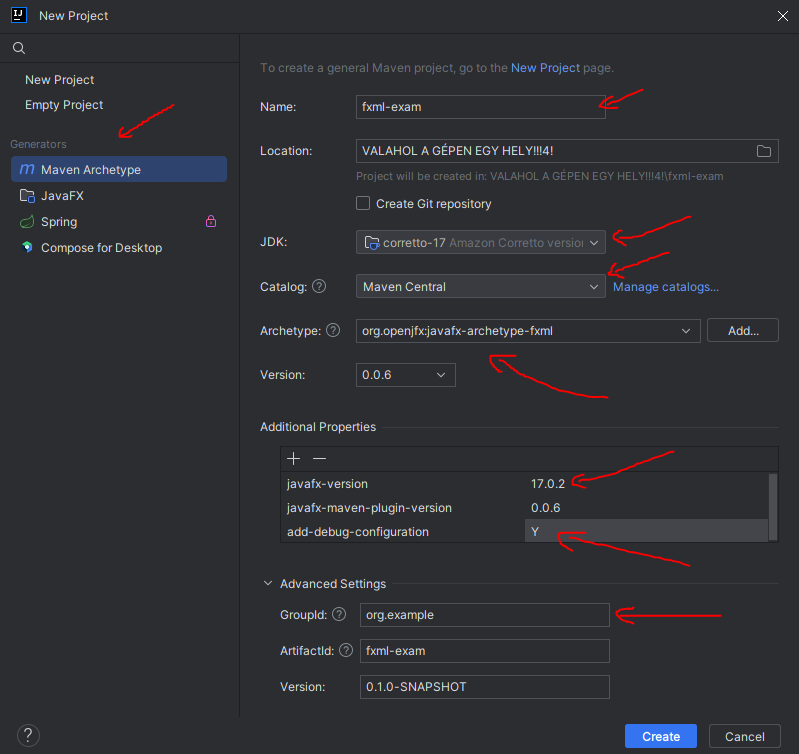
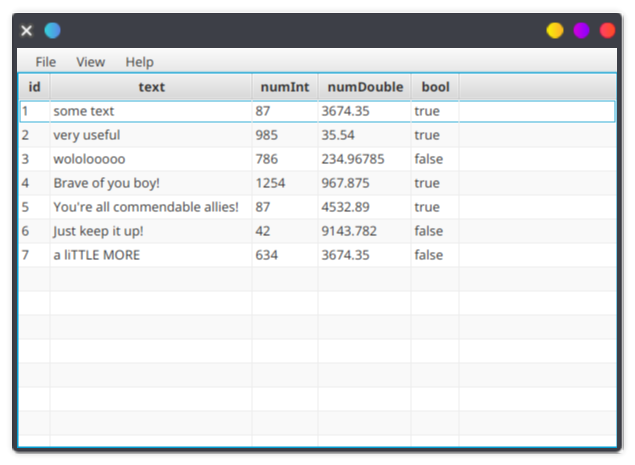
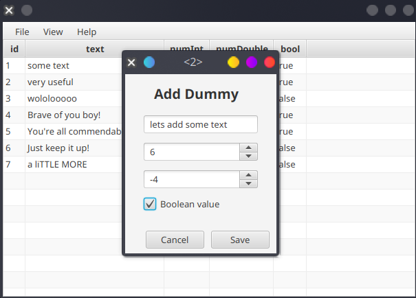

# Példa ZH

Vegyük sorra, hogyan kellene végigjátszanunk egy ZH-t.
Jelen projektben bármilyen modell osztály lehetne, mint kezelt rekord,
így most egy teljesen absztrakt példán keresztül fogjuk ezt megnézni. (Lesz egy dummy modellünk).

## Projekt létrehozás

Nyissuk meg az IntelliJ IDEA-t!
Kattintsunk az új projekt létrehozására, majd az `org.openjfx:javafx-archetype-fxml`
archetype segítségével generáljunk egy nekünk tetsző kezdő projektet. Ehhez a `Catalog` menüpont alól válasszuk ki
a `Maven Central`-t. Figyeljünk a választott javafx verzióra, valamint adjunk egy tetszőleges nevel,
valamint groupId-t projektünknek.



A generált projektünkből kitörölhetünk minden szükségtelen dolgot, mint pl. `PrimaryController`,
valamint `SecondaryController`, és az ehhez tartozó view fájlok.

A generált [pom.xml](./pom.xml) fájlban, amennyiben frisebb Java verziót használnánk,
a következő sorok módosításra szorulhatnak, amennyiben ott nem az általunk kiszemelt verziót találjuk.

```xml
<!-- version number bump: 11 -> 17 -->
<maven.compiler.source>17</maven.compiler.source>
<maven.compiler.target>17</maven.compiler.target>
```

Amennyiben szeretnénk lombok-ot használni, úgy változtatásra szorul a `maven-compiler-plugin` is,
valamint vegyük ezt be a függőségeink közé is:

```xml
<dependency>
    <groupId>org.projectlombok</groupId>
    <artifactId>lombok</artifactId>
    <version>1.18.30</version>
</dependency>
```

Ilyenkor a `maven-compiler-plugin`:

```xml
<plugin>
    <groupId>org.apache.maven.plugins</groupId>
    <artifactId>maven-compiler-plugin</artifactId>
    <version>3.12.1</version>
    <configuration>
        <annotationProcessorPaths>
            <path>
                <groupId>org.projectlombok</groupId>
                <artifactId>lombok</artifactId>
                <version>1.18.30</version>
            </path>
        </annotationProcessorPaths>
    </configuration>
</plugin>
```

Valamint a [module-info.java](./src/main/java/module-info.java) fájlba is tegyük bele a következőt:

```java
module hu.inf.szte {
    ...
    requires lombok;
    
    ...
}
```

Ha a fenti módon hoztunk létre projektet, akkor a ugyan a következő sorok része kéne,
hogy legyenek a [module-info.java](./src/main/java/module-info.java) fájlnak, azonban bizonyosodjunk meg róla,
hogy a következőket valóban tartalmazza-e.

```java
module hu.inf.szte {
  opens hu.inf.szte to javafx.fxml;
  // ezt majd később, de ez is itt kell majd legyen a kontrollerek miatt
  //opens hu.inf.szte.controller to javafx.fxml;
  // valamint adott esetben ő is, a modellek miatt
  //opens hu.inf.szte.model to javafx.base;

  exports hu.inf.szte;
}
```

## Model

A modell osztály az egyik legegyszerűbb dolog, amivel kezdhetünk, szóval kezdjük evvel!
Legyen most egy `Dummy` reprezentálására szolgáló modell osztályunk.

[Dummy.java](./src/main/java/hu/inf/szte/model/Dummy.java)

```java
@NoArgsConstructor
@AllArgsConstructor
@Getter
@Setter
@ToString
public class Dummy {

    // Primary key
    private Long id;
    // Some string field
    private String text;
    // Some integer field
    private Integer numInt;
    // Some double field
    private Double numDouble;
    // Some boolean field
    private Boolean bool;
}
```

Note: az idejutáshoz, maximum kb. 15-20 kellene forduljon.

## DAO

A `Data Access Object` lesz önmagában (pont-ügyileg) a legtöbbet érő részleg.
Egy ehhez tartozó interface:

```java
public interface Dao<T> {

    // Egy modell mentésére fog szolgálni
    void save(@NonNull T model);
    // Rekordok lekérdezésére szolgáló metódus
    List<T> findAll();
    // Adott kritérium alapján történő rekordok lekérése,
    // ahol a rekord, mint modell osztály,
    // adott mezői ÉS kapcsolóval lesznek összefűzve
    List<T> findAllByCrit(@NonNull T model);
}
```

Amikor az egyes `DAO` implementációkhoz jutunk, akkor már elég valószínű,
hogy szükségünk lesz a `java.sql` csomagra is, így frissítsük a [module-info.java](./src/main/java/module-info.java)
fájlt is.

```java
module hu.inf.szte {
    ...
    requires java.sql;
    
    ...
}
```

Lehetséges implementációk:

[DummySqliteJdbcDao.java](./src/main/java/hu/inf/szte/data/DummySqliteJdbcDao.java)

```java
/**
 * Sikeres lefutás esetén, a leadott modell mentésre kerül,
 * valamint kap egy elsődleges kulcsot is.
 * 
 * @param model Modell, ami alapján egy új rekord készül, és mentésre kerül
 */
@Override
public void save(@NonNull Dummy model) {
    // A connection és a prepareStatement implementálják a Closeable interface-t,
    // így ezek lezárására ügyeljünk!
    try (var conn = dataSource.getConnection();
         var stmt = conn.prepareStatement("INSERT INTO " + TABLE +
                 " (text_value, integer_value, double_value, bool_value)" +
                 " VALUES (?, ?, ?, ?);")) {

        // értékadás egyes placeholder-ek (?) helyére
        stmt.setString(1, model.getText());
        stmt.setInt(2, model.getNumInt());
        stmt.setDouble(3, model.getNumDouble());
        stmt.setBoolean(4, model.getBool());

        // generált kulcs (pk) lekérdezése
        try (var result = stmt.getGeneratedKeys()) {
            if (result.next()) {
                model.setId(result.getLong(1));
            }
        }
    } catch (SQLException e) {
        throw new RuntimeException(e);
    }
}

/**
 * Összes rekord lekérdezése a kezelt perzisztens tárhelytől.
 * 
 * @return Tartós tárhelyben élő rekordok.
 */
@Override
public List<Dummy> findAll() {
    // Egy listában fogjuk visszaadni eredményeinket
    var models = new ArrayList<Dummy>();
    // Itt eredményeink egyszerűen láncolhatók, elég egy try-with-resource blokk.
    try (var conn = dataSource.getConnection();
         var stmt = conn.createStatement();
         var result = stmt.executeQuery("SELECT * FROM " + TABLE + ";")) {

        // eredmények iterálása
        while (result.next()) {
            models.add(new Dummy(result.getLong("id"),
                    result.getString("text_value"),
                    result.getInt("integer_value"),
                    result.getDouble("double_value"),
                    result.getBoolean("bool_value")));
        }
    } catch (SQLException e) {
        throw new RuntimeException(e);
    }
    return models;
}

/**
 * Összes rekord lekérdezése a kezelt perzisztens tárhelytől.
 * A kapott kritérium egyes mezői ÉS kapcsolóval fűződnek össze,
 * valamint ebben az implementációban az adatbázis oldalán van
 * megvalósítva a szűrés. Amennyiben egy minden mezejében null
 * modell kerül leadásra, úgy az eredmény = findAll().
 *
 * @param model Szűrési feltételként leadott modell
 * @return Tartós tárhelyben élő rekordok, melyek megfelelnek a leadott kritériumnak
 */
@Override
public List<Dummy> findAllByCrit(@NonNull Dummy model) {
    var models = new ArrayList<Dummy>();
    var where = new ArrayList<String>();

    // WHERE feltétel előkészítése
    if (model.getId() != null) {
        where.add("id = ?");
    }
    if (model.getText() != null && !model.getText().isEmpty()) {
        where.add("LOWER(text_value) LIKE ?");
    }
    if (model.getNumInt() != null) {
        where.add("integer_value = ?");
    }
    if (model.getNumDouble() != null) {
        where.add("double_value = ?");
    }
    if (model.getBool() != null) {
        where.add("bool_value = ?");
    }

    // Csak akkor szeretnénk hozzáfűzni a feltételt
    // a kész string-hez, ha az nem üres.
    // Más esetben pedig egy effektíve feltétel
    // nélküli lekérdezés történik
    String cond = "";
    if (!where.isEmpty()) {
        // ÉS kapcsolókkal való join
        cond = " WHERE " + String.join(" AND ", where);
    }
    String stmtString = "SELECT * FROM " + TABLE + cond + ";";

    try (var conn = dataSource.getConnection();
         var stmt = conn.prepareStatement(stmtString)) {

        int index = 0;
        // Egyesével beállítjuk az esetleges placeholder-ek értékét
        if (model.getId() != null) {
            stmt.setLong(++index, model.getId());
        }
        if (model.getText() != null && !model.getText().isEmpty()) {
            // wildcard - éles helyzetben figyeljünk az esetleges bugokra!
            stmt.setString(++index, "%" + model.getText().toLowerCase() + "%");
        }
        if (model.getNumInt() != null) {
            stmt.setInt(++index, model.getNumInt());
        }
        if (model.getNumDouble() != null) {
            stmt.setDouble(++index, model.getNumDouble());
        }
        if (model.getBool() != null) {
            stmt.setBoolean(++index, model.getBool());
        }
        try (var result = stmt.executeQuery()) {
            while (result.next()) {
                models.add(new Dummy(result.getLong("id"),
                        result.getString("text_value"),
                        result.getInt("integer_value"),
                        result.getDouble("double_value"),
                        result.getBoolean("bool_value")));
            }
        }
    } catch (SQLException e) {
        throw new RuntimeException(e);
    }
    return models;
}
```

Egy másik lehetséges implementációhoz pedig látogassunk el a következő fájlhoz,
amely a [jooq](https://www.jooq.org/) csomagot használja.
Evvel a függőséggel talán kicsit egyszerűbb sql utasításokat végrehajtani,
használata teljesen opcionális.

[DummyJooqDao.java](./src/main/java/hu/inf/szte/data/DummyJooqDao.java)

```java
@Override
public void save(@NonNull Dummy model) {
    var columns = List.of(field(name("text_value")),
            field(name("integer_value")),
            field(name("double_value")),
            field(name("bool_value")));
    var values = List.of(model.getText(),
            model.getNumInt(),
            model.getNumDouble(),
            model.getBool());
    // DataSource hasonló helyről jön, mint az előző esetben is,
    // az sqlDialect pedig esetünkben: sqlDialect = SQLDialect.SQLITE
    var id = DSL.using(dataSource, sqlDialect)
            .insertInto(table(name(TABLE)))
            .columns(columns)
            .values(values)
            .returningResult(field(name("id")))
            .fetchOne("id", Long.class);
    assert id != null && id > 0;
    model.setId(id);
}

@Override
public List<Dummy> findAll() {
    return DSL.using(dataSource, sqlDialect)
            .select()
            .from(table(name(TABLE)))
            .fetch(r -> new Dummy(r.get("id", Long.class),
                    r.get("text_value", String.class),
                    r.get("integer_value", Integer.class),
                    r.get("double_value", Double.class),
                    r.get("bool_value", Boolean.class)));
}

@Override
public List<Dummy> findAllByCrit(@NonNull Dummy model) {
    var where = new ArrayList<Condition>();
    if (model.getId() != null) {
        where.add(field(name("id")).eq(model.getId()));
    }
    if (model.getText() != null && !model.getText().isEmpty()) {
        where.add(field(name("text_value")).likeIgnoreCase("%" + model.getText() + "%"));
    }
    if (model.getNumInt() != null) {
        where.add(field(name("integer_value")).eq(model.getNumInt()));
    }
    if (model.getNumDouble() != null) {
        where.add(field(name("double_value")).eq(model.getNumDouble()));
    }
    if (model.getBool() != null) {
        where.add(field(name("bool_value")).eq(model.getBool()));
    }
    return DSL.using(dataSource, sqlDialect)
            .select()
            .from(table(name(TABLE)))
            .where(and(where))
            .fetch(r -> new Dummy(r.get("id", Long.class),
                    r.get("text_value", String.class),
                    r.get("integer_value", Integer.class),
                    r.get("double_value", Double.class),
                    r.get("bool_value", Boolean.class)));
}
```

Ezen implementáció a következő csomagot használja, mint függőség:

```xml
<dependency>
    <groupId>org.jooq</groupId>
    <artifactId>jooq</artifactId>
    <version>3.19.6</version>
</dependency>
```

Ezt ugyanúgy szükséges felvenni a [module-info.java](./src/main/java/module-info.java) fájlba.

```java
module hu.inf.szte {
    ...
    requires org.jooq;
    
    ...
}
```

Evvel pedig a szekció végéhez is értünk.
Az ide jutáshoz maximum kb. 40 perc kellene, hogy szánódjon összesen,
de ha csak idáig jutunk el se csüggedjünk, ugyanis a különállóan legtöbb
pontot érő rész ezennel meg is van! (Amennyiben helyes persze.)

## View

Egy menü-vezérelt alkalmazást szeretnénk összerakni, read, és add funkciókkal.
Azaz szeretnénk, hogy alkalmazásunk képes legyen `Dummy` objektumok listázására, és mentésére.
További elvárásunk, hogy legyen a menüben egy `File > Close` menüpont is, ahol a `Close`-ra
kattintva bezárhatjuk az alkalmazásunkat. Mielőtt ez megtörténne, megkérdezzük a felhasználót,
hogy valóban ki szeretne-e lépni, és csak ezután hagyjuk el az alkalmazást.

### Read

A listázás ebben a kontextusban hasonlóképpen kellene kinézzen:



Egy egyszerű [TableView](https://jenkov.com/tutorials/javafx/tableview.html)
fog szolgálni a listázási komponensünkként.

A [dummy/read.fxml](./src/main/resources/hu/inf/szte/fxml/dummy/read.fxml) fájl lényegi része,
egészen egyszerűen a következő sorokat tartalmazhatja:

```xml
<AnchorPane xmlns:fx="http://javafx.com/fxml/1" prefHeight="400.0" prefWidth="600.0" AnchorPane.bottomAnchor="0.0"
            AnchorPane.leftAnchor="0.0" AnchorPane.rightAnchor="0.0" AnchorPane.topAnchor="0.0"
            xmlns="http://javafx.com/javafx/17.0.2-ea" fx:controller="hu.inf.szte.controller.DummyReadController">
    <TableView fx:id="dummyTableView" prefHeight="361.0" prefWidth="600.0" AnchorPane.bottomAnchor="0.0" AnchorPane.leftAnchor="0.0"
               AnchorPane.rightAnchor="0.0" AnchorPane.topAnchor="0.0">
    </TableView>
</AnchorPane>
```

A legfontosabb, hogy van egy `fx:id`-vel ellátott `TableView` komponensünk, melyet a megfelelő kontrollerből
könnyedén elérhetünk, és manipulálhatunk. Vegyük észre a `fx:controller` által kijelölt kontrollert is!

Ez most csak egy üres TableView, ne aggódjunk miatta, a view fájlunk evvel már lényegében készen van,
a kontrollert majd megalkotjuk, ha odaérünk.

### Add

Térjünk rá a következő megvalósítandó részre, a hozzáadás dialógusra.
Itt már kicsit több dolgunk lesz, ám a modell osztály alapján ez a
nézet is könnyedén megvalósítható, bár kicsit hosszasabb folyamat.
Megvalósítás után az adott view pl. a következőképpen nézhet ki.



[dummy/add.fxml](./src/main/resources/hu/inf/szte/fxml/dummy/add.fxml)

```xml
<AnchorPane xmlns:fx="http://javafx.com/fxml/1" prefHeight="261.0" prefWidth="203.0"
            xmlns="http://javafx.com/javafx/17.0.2-ea" fx:controller="hu.inf.szte.controller.DummyAddController">
    <Label layoutX="42.0" layoutY="14.0" text="Add Dummy" textAlignment="CENTER" AnchorPane.leftAnchor="42.0"
           AnchorPane.rightAnchor="41.0" AnchorPane.topAnchor="14.0">
        <font>
            <Font name="System Bold" size="20.0"/>
        </font>
    </Label>
    <TextField fx:id="textValueTextField" layoutX="27.0" layoutY="61.0" AnchorPane.leftAnchor="27.0"
               AnchorPane.rightAnchor="27.0"
               AnchorPane.topAnchor="60.0">
        <tooltip>
            <Tooltip text="Text Value"/>
        </tooltip>
    </TextField>
    <Spinner fx:id="integerValueSpinner" layoutX="27.0" layoutY="99.0" AnchorPane.leftAnchor="27.0"
             AnchorPane.rightAnchor="27.0"
             AnchorPane.topAnchor="100.0" editable="true">
        <tooltip>
            <Tooltip text="Integer Value"/>
        </tooltip>
    </Spinner>
    <Spinner fx:id="doubleValueSpinner" layoutX="27.0" layoutY="99.0" AnchorPane.leftAnchor="27.0"
             AnchorPane.rightAnchor="27.0"
             AnchorPane.topAnchor="140.0" editable="true">
        <tooltip>
            <Tooltip text="Double Value"/>
        </tooltip>
    </Spinner>
    <CheckBox fx:id="booleanValueCheckBox" layoutX="27.0" layoutY="186.0" mnemonicParsing="false" prefHeight="17.0"
              prefWidth="149.0"
              text="Boolean value" AnchorPane.topAnchor="180.0">
        <tooltip>
            <Tooltip text="Boolean Value"/>
        </tooltip>
    </CheckBox>
    <ButtonBar layoutX="2.0" layoutY="221.0" prefHeight="40.0" prefWidth="200.0" AnchorPane.bottomAnchor="0.0"
               AnchorPane.leftAnchor="0.0" AnchorPane.rightAnchor="0.0">
        <buttons>
            <Button mnemonicParsing="false" text="Cancel" onAction="#onCancel"/>
            <Button mnemonicParsing="false" text="Save" onAction="#onSave"/>
        </buttons>
        <padding>
            <Insets left="10.0" right="10.0"/>
        </padding>
    </ButtonBar>
</AnchorPane>
```

Pontosan annyi, és olyan típusú beviteli mezőt kell létrehozzunk (kivéve elsődleges kulcs - itt: `Dummy::id`),
amennyit a modell osztályunk definiál. Ilyenkor egyszerűen nyissuk meg egy másik ablakban a modell osztályunkat,
s közben mellette `SceneBuilder`, avagy egyéb tetsző alkalmatosság segítségével rakjuk össze a dialógus ablakot.
Figyeljük meg, hogy itt is minden beviteli mező rendelkezik id-vel, valamint van két gomb is, egy `Save`,
és egy `Cancel`, melyek a mentésért, és a dialógus ablak elhagyásáért lesznek felelősek.

### Menu

Készítsük el ezek után a menüvezérlést.

Ennek implementációját a [main.fxml](./src/main/resources/hu/inf/szte/fxml/main.fxml) fájl alatt találhatjuk,
melynek lényege a következő:

```xml
<AnchorPane xmlns:fx="http://javafx.com/fxml/1" prefHeight="400.0" prefWidth="600.0"
            xmlns="http://javafx.com/javafx/17.0.2-ea" fx:controller="hu.inf.szte.controller.MainController">
    <MenuBar AnchorPane.leftAnchor="0.0" AnchorPane.rightAnchor="0.0" AnchorPane.topAnchor="0.0">
        <Menu mnemonicParsing="false" text="File">
            <MenuItem mnemonicParsing="false" onAction="#onCloseMenuItem" text="Close"/>
        </Menu>
        <Menu mnemonicParsing="false" text="View">
            <Menu mnemonicParsing="false" text="Dummy">
                <MenuItem mnemonicParsing="false" onAction="#onDummyAddMenuItem" text="Add"/>
                <MenuItem mnemonicParsing="false" onAction="#onDummyListMenuItem" text="List"/>
            </Menu>
        </Menu>
        <Menu mnemonicParsing="false" text="Help">
            <MenuItem mnemonicParsing="false" onAction="#onAboutMenuItem" text="About"/>
        </Menu>
    </MenuBar>
    <AnchorPane fx:id="rootPane" prefHeight="400.0" prefWidth="600.0" AnchorPane.bottomAnchor="0.0"
                AnchorPane.leftAnchor="0.0" AnchorPane.rightAnchor="0.0" AnchorPane.topAnchor="25.0"/>
</AnchorPane>
```

Található benne 4 parancs végrehajtására szolgáló menüpont (`Close`, `Add`, `List`, és `About`), valamint egy
`fx:id`-vel ellátott `AnchorPane`. Ebbe a panelbe fogjuk majd betölteni a listánkat,
azaz az előző [read view](#read)-t.

Note: Amire ide érünk maximum 60 perc kellene elteljen, de az lenne jó, ha kicsit kevesebb, inkább 50 perc lenne. 

## Controller

### Read

Vegyük kezdetben a [read view](#read) részhez tartozó kontrollert. Szeretnénk, ha ez a kontroller csupán a
tábla feltöltéséért lenne felelős, azaz rendelkezik a még view fájlban `fx:id` alapján megadott `TableView`-el,
valamint egy `DAO`-val, amely többek között a rekordok lekérdezéséért felelős.
A kontroller osztályunk ekkor:

```java
public class DummyReadController {

    private final Dao<Dummy> dao;

    @FXML
    private TableView<Dummy> dummyTableView;

    public DummyReadController() {
        // használjunk egy nekünk tetsző dao implementációt, pl.:
        // dao = new DummySqliteJdbcDao(SingletonSqliteDataSource.getInstance().getDataSource());
        dao = new DummyJooqDao(SingletonSqliteDataSource.getInstance().getDataSource(), SQLDialect.SQLITE);
    }

    @FXML
    private void initialize() {
        // Ha szeretnénk, ezt megleshetjük az Util szekcióban
        TableSupport.from(Dummy.class, dummyTableView).createSchema();
        // Itt lekérjük a dao-tól a megfelelő rekordokat, majd az eredményt hozzáadjuk egy binding-hoz.
        // Ez a binding a Services szekcióban található, ott olvashatunk használatáról, a lényeg itt most
        // annyi volna, hogy evvel a binding-listával fogunk kommunikálni kontrollerek között.
        // Ez jobb esetben elintézhető lenne egy megfelelő DI framework-el,
        // de mi most nem rendelkezünk hasonlókkal.
        SingletonDummyBinder.getInstance().dataProperty().set(FXCollections.observableList(dao.findAll()));
        // Ugyanettől a binding-listától lekérjük az adatokat, és elrakjuk mint a tábla sorait.
        dummyTableView.setItems(SingletonDummyBinder.getInstance().dataProperty());
    }
}
```

Ami ebben a kontrollerben történik egyszerűnek tűnik, ám több dolog is áll a háttérben.
Először is tervezés szempontjából a view réteg után kényelmes lenne a kontrollerek
megvalósításával foglalkozni, azonban egy megfelelő DI (Dependency Injection) framework nélkül
az egyes kontrollerek közötti "kevésbé vadul megoldott" kommunikáció nehézségekbe ütközhet.
Főleg úgy, hogy valószínűleg nem akarunk custom FXML loader mechanizmust implementálni.
Ezeket figyelembe véve Singleton kiszolgálókat fogunk létrehozni. Kikre lesz szükségünk?

A következő service-ekre lesz majd szükségünk:

- [SingletonDummyBinder](src/main/java/hu/inf/szte/service/SingletonDummyBinder.java),
  hogy összeköttetést biztosítsunk adott kontrollerek közötti adat szinkronizációban,
- [SingletonSqliteDataSource](src/main/java/hu/inf/szte/service/SingletonSqliteDataSource.java),
  hogy valahonnan legyen végre egy adat forrásunk
  [DataSource](https://www.digitalocean.com/community/tutorials/java-datasource-jdbc-datasource-example), VAGY
- [SingletonHikariDataSource](src/main/java/hu/inf/szte/service/SingletonHikariDataSource.java) a fentivel azonos,
  csak Hikari connection pool implementációval.

Kalandunk folytatódhat ugyan itt is, ám aki úgy érezné, hogy a továbbiakban logikusabb lenne először
a service-k oldaláról megismerni a dolgot, úgy ellátogathatunk a [Services](#services) szekcióhoz.

### Create

Következőre nézzük meg az adatok hozzáadására szolgáló kontrollert.

[DummyAddController](src/main/java/hu/inf/szte/controller/DummyAddController.java)

```java
public class DummyAddController {

    private final Dao<Dummy> dao;

    // Itt találhatók a ui beviteli mezői
    @FXML
    private TextField textValueTextField;
    @FXML
    private Spinner<Integer> integerValueSpinner;
    @FXML
    private Spinner<Double> doubleValueSpinner;
    @FXML
    private CheckBox booleanValueCheckBox;

    public DummyAddController() {
        // dao létrehozása
        dao = new DummyJooqDao(SingletonSqliteDataSource.getInstance().getDataSource(), SQLDialect.SQLITE);
    }

    @FXML
    private void initialize() {
        // Hasonló dolgok megtehetők az fxml fájlban is, ám itt most a konstansok
        // kódból való kényelmesebb használata miatt itt fogunk értéket adni a
        // spinnerek value factory-jának.
        integerValueSpinner.setValueFactory(new SpinnerValueFactory.IntegerSpinnerValueFactory(
                Integer.MIN_VALUE, Integer.MAX_VALUE, 0));
        doubleValueSpinner.setValueFactory(new SpinnerValueFactory.DoubleSpinnerValueFactory(
                -Double.MAX_VALUE, Double.MAX_VALUE, 0));
    }

    @FXML
    public void onCancel() {
        // ablak bezárása
        destroy();
    }

    @FXML
    public void onSave() {
        // egy új dummy objektum mentése
        dao.save(new Dummy(null,
                textValueTextField.getText(),
                integerValueSpinner.getValue(),
                doubleValueSpinner.getValue(),
                booleanValueCheckBox.isSelected()));
        // töltsük újra a binding-listát
        // (így a tábla "magától" frissülni látszik majd)
        SingletonDummyBinder.getInstance()
                .dataProperty()
                .set(FXCollections.observableList(dao.findAll()));
        // ablak bezárása
        destroy();
    }

    private void destroy() {
        // Bármely mezőtől lekérhetjük az őt tartalmazó scene-t,
        // majd tőle az ablakot, amelyet könnyedén be is zárhatunk
        // Mivel az add kontroller által vezérelt ablakot dialógus
        // ablakként tervezzük, ezért így járunk el.
        ((Stage) textValueTextField.getScene().getWindow()).close();
    }
}
```

Evvel meg is volnánk az `AddController`-el.

### Main (menu)

Végezetül pedig készítsük el az egész alkalmazást összefogó menüt. Így:

```java
public class MainController {

    private SceneLoader sceneLoader;

    @FXML
    private AnchorPane rootPane;

    public MainController() {
    }

    @FXML
    private void initialize() {
        // Inicializáláskor megadjuk a root panelt,
        // valamint az App.class-t, mint kontextust.
        sceneLoader = new SceneLoader(App.class, rootPane);
        // azonnal át is váltunk a dummy/read view-re
        sceneLoader.changePanel("dummy/read");
    }

    @FXML
    private void onCloseMenuItem() {
        // Megkérdezzük a felhasználót, hogy valóban ki akar-e lépni.
        var alertResult = new Alert(Alert.AlertType.CONFIRMATION,
                "Sure you want to close the application?",
                ButtonType.YES, ButtonType.NO, ButtonType.CANCEL)  // yes, no ( és cancel :) ) button
                .showAndWait();  // dialógus mutatása
        if (alertResult.isPresent() && alertResult.get() == ButtonType.YES) {
            Platform.exit();
        }
    }

    @FXML
    private void onDummyListMenuItem() {
        // Egyetlen ilyen view van, de miért ne?
        sceneLoader.changePanel("dummy/read");
    }

    @FXML
    private void onDummyAddMenuItem() {
        // A dialógus ablaknak létrehozunk egy új stage-t.
        // Itt nagyon hasonlóan fogunk eljárni, mint ahogyan
        // az App osztályban is található
        var stage = new Stage();
        stage.initModality(Modality.APPLICATION_MODAL);

        try {
            // töltsük be a scene-be az add form-ot
            stage.setScene(new Scene(sceneLoader.loadFXML("dummy/add")));
            stage.showAndWait();  // viselkedjél dialógusként
        } catch (IOException e) {
            // halál
            new Alert(Alert.AlertType.ERROR,
                    "Failed to load scene.\n%s".formatted(e.getMessage()),
                    ButtonType.OK)
                    .showAndWait();
        }
    }

    @FXML
    private void onAboutMenuItem() {
        // mutassunk egy kis törődést
        new Alert(Alert.AlertType.INFORMATION,
                "This app is made with great care, just for you, and only you <3",
                ButtonType.OK)
                .showAndWait();
    }
}
```

Ha minden jól ment, akkor 90 perc alatt el is jutottunk idáig,
feltöltöttük munkásságunkat bíróra is,
és mehetünk is haza a szinte már zsebre rakott ötösünkkel.

## Services

Az itt jelen lévő dolgokra gondolhatunk olyasfajta globális változóként.
Programunk egyes részei közti kommunikáció megvalósításáért lesznek felelősek.

### Data binding

[SingletonDummyBinder](src/main/java/hu/inf/szte/service/SingletonDummyBinder.java)

```java
public class SingletonDummyBinder {

    // Egy binding list, amivel majd az adatok szinkronizációját végezhetjük
    // Az egész class, (mint wrapper) ezért az egy "globális" változóért
    // kerül implementálásra.
    private final SimpleListProperty<Dummy> dataBinding;

    // 1. Singleton rész: tegyük priváttá a konstruktort! 
    private SingletonDummyBinder() {
        // itt fogjuk létrehozni az egyetlen egy adat szinkronizáló objektumot
        dataBinding = new SimpleListProperty<>();
    }

    // 2. Singleton rész: legyen egy getInstance statikus metódusunk,
    // amely saját magát tartalmazó osztállyal tér vissza.
    // Vegyük észre, hogy nem kell szinkronizácó!
    public static SingletonDummyBinder getInstance() {
        return BinderInstance.INSTANCE;
    }

    // Data binding kiszolgálása (kell hozzá egy getter)
    public SimpleListProperty<Dummy> dataProperty() {
        return dataBinding;
    }

    // 3. Singleton rész: készítsünk egy rejtett tartalmazó osztályt,
    // amely betöltéskor az adott (külső) példány osztály létrehozásáért felelős.
    private static class BinderInstance {
        // A példány csak a BinderInstance class betöltésekor fog létrejönni,
        // és ezt maga a JVM garantálja!
        private static final SingletonDummyBinder INSTANCE = new SingletonDummyBinder();
    }
}
```

A kód nagy része csupán a singleton osztályunk megvalósításáért felelős,
független attól, hogy magát az osztályt mire is szeretnénk használni.
Vegyük észre, hogy ha így járunk el, akkor nincs szükség szinkronizációra,
ugyanis a JVM osztályok betöltésekor nem enged más szálat hozzányúlni az adott
osztályhoz. Így az ún. [race condition](https://stackoverflow.com/questions/34510/what-is-a-race-condition)-októl
nem kell tartanunk, és ez platform függetlenül, JVM garancia! Továbbá szintén garantálva van,
hogy lazy módon történik a betöltés, ugyanis a JVM csak akkor fogja betölteni az adott osztályt,
amennyiben szükségünk van rá, azaz ha a `getInstance()` függvény meghívásra kerül.

### Data source

Hasonló módon járhatunk el a data source esetén is. Szinte copy paste, a lényegi részektől eltekintve.

[SingletonSqliteDataSource](src/main/java/hu/inf/szte/service/SingletonSqliteDataSource.java)

```java
@Getter
public class SingletonSqliteDataSource {

    private final SQLiteDataSource dataSource;
    // Mivel ez nem connection pool, ezért memória db esetén
    // szeretnénk, ha mindig lenne egy élő connection. Ez azért
    // lényeges, hogy megmaradjon az adatbázisunk. Memory db esetén
    // ugyanis az utolsó connection elzárásakor törlődik a memóriában
    // élő MINDEN.
    private final Connection keepAlive;

    private SingletonSqliteDataSource() {
        dataSource = new SQLiteDataSource();
        dataSource.setUrl(ConfigSupport.getDbUrl());
        try {
            keepAlive = dataSource.getConnection();
        } catch (SQLException e) {
            throw new RuntimeException(e);
        }
    }

    public static SingletonSqliteDataSource getInstance() {
        return SingletonInstance.INSTANCE;
    }

    private static final class SingletonInstance {
        private static final SingletonSqliteDataSource INSTANCE = new SingletonSqliteDataSource();
    }
}
```

Ebben a megvalósításban az [SQLite JDBC Driver](https://github.com/xerial/sqlite-jdbc)-t használjuk,
azonban, ha a `Connection Pool` jobban érdekel minket (mivel az egy pool ott nem kell keepAlive),
akkor nézzük meg a [SingletonHikariDataSource](src/main/java/hu/inf/szte/service/SingletonHikariDataSource.java)
megvalósítását. Ezek közül csak az egyiket kell megvalósítani, és mégfontosabb,
hogy ne használjuk őket felcserélve! Vagy ezt, vagy azt.

Ahhoz, hogy ezt használjuk húzzuk be a következő függőséget:

```xml
<dependency>
    <groupId>org.xerial</groupId>
    <artifactId>sqlite-jdbc</artifactId>
    <version>3.45.2.0</version>
</dependency>
```

majd túrjunk bele a [module-info.java](./src/main/java/module-info.java) fájlba is.

```java
module hu.inf.szte {
    ...
    requires org.xerial.sqlitejdbc;
    
    ...
}
```

A service rész evvel készen is van.

## Util

Ezek a segédosztályok rendelkezésre fognak állni, itt pedig lesz egy kis rész a használatukról.
Összefoglalva itt találhatjuk listájukat:

- [ConfigSupport.java](./src/main/java/hu/inf/szte/util/cfg/ConfigSupport.java)
- [SqlDbSupport.java](./src/main/java/hu/inf/szte/util/db/SqlDbSupport.java)
- [SceneLoader.java](./src/main/java/hu/inf/szte/util/fx/SceneLoader.java)
- [TableSupport.java](./src/main/java/hu/inf/szte/util/fx/TableSupport.java)

[ConfigSupport.java](./src/main/java/hu/inf/szte/util/cfg/ConfigSupport.java)

```java
public final class ConfigSupport {
    
    // Itt fognak lakni az egyes konfigurációk
    private static final Properties props = new Properties();

    // Ez nem lazy, itt egyből betöltünk mindent,
    // amint az osztály maga betöltésre kerül a JVM által.
    static {
        try (var stream = ConfigSupport.class.getClassLoader()
                .getResourceAsStream("application.properties")) {
            props.load(stream);
        } catch (IOException e) {
            throw new RuntimeException(e);
        }
    }
    
    // Egyetlen kiszervezett property,
    // ami most a db url-ének lekérésére szolgál.
    public static String getDbUrl() {
        return props.getProperty("db.url");
    }
}
```

Használata pofon egyszerű. Csupán használnunk kell egyetlen statikus metódusát:

```java
ConfigSupport.getDbUrl();  // jdbc:sqlite:file:memdb1?mode=memory&cache=shared
```

[SqlDbSupport.java](./src/main/java/hu/inf/szte/util/db/SqlDbSupport.java)

```java
/**
 * Arra használhatjuk, hogy adott sql input-ot futtasunk.
 * Eredeti terv szerint fájlból olvasott tartalom futtatására szolgál,
 * ám egy String is átalakítható {@link java.io.InputStream}-é,
 * ha valakinek szimpatikusabb.
 */
public class SqlDbSupport {

    private final DataSource dataSource;

    public SqlDbSupport(DataSource ds) {
        dataSource = ds;
    }

    // Elfogad egy input stream-et, beolvassa tartalmát,
    // majd végrehajtja a benne található sql utasításokat.
    public void executeSqlFile(InputStream s) {
        try (var reader = new BufferedReader(new InputStreamReader(Objects.requireNonNull(s)));
             var conn = dataSource.getConnection();
             var stmt = conn.createStatement()) {
            var sql = reader.lines().collect(Collectors.joining());
            // `;` karakterek mentén vágunk
            var sqlCommands = sql.split("(?<=;)");
            for (var c : sqlCommands) {
                stmt.addBatch(c);
            }
            stmt.executeBatch();
        } catch (SQLException | IOException e) {
            throw new RuntimeException(e);
        }
    }

    public void createTablesIfNotExist() {
        try (var stream = getClass().getClassLoader().getResourceAsStream("create.sql")) {
            executeSqlFile(stream);
        } catch (IOException e) {
            throw new RuntimeException(e);
        }
    }

    public void dropTablesIfExist() {
        try (var stream = getClass().getClassLoader().getResourceAsStream("drop.sql")) {
            executeSqlFile(stream);
        } catch (IOException e) {
            throw new RuntimeException(e);
        }
    }

    public void insertIntoTables() {
        try (var stream = getClass().getClassLoader().getResourceAsStream("insert.sql")) {
            executeSqlFile(stream);
        } catch (IOException e) {
            throw new RuntimeException(e);
        }
    }
}
```

Ennek használatát megtekinthetjük pl. az [App.java](./src/main/java/hu/inf/szte/App.java) fájlban,
az `initDb` függvényben.

Egy másik utility osztályunk a [SceneLoader](./src/main/java/hu/inf/szte/util/fx/SceneLoader.java).
Ezt olyan helyeken érdemes használni, ahol valamiféle fxml fájl betöltése történik
(ekkor a `loadFXML` rész érdekesebb), avagy panelek tartalmát szeretnénk kicserélni
(amikoris pedig a `changePanel` rész lesz relevánsabb).

```java
public record SceneLoader(Class<?> resource, Pane pane) {

    private static final String VIEW_ROOT = "fxml";

    public void changePanel(Parent parent) throws NullPointerException {
        pane.getChildren().clear();
        pane.getChildren().add(parent);
    }

    public void changePanel(String fxml) throws NullPointerException {
        try {
            changePanel(loadFXML(fxml));
        } catch (IOException e) {
            throw new RuntimeException(e);
        }
    }
    
    public Parent loadFXML(String fxml) throws IOException {
        FXMLLoader fxmlLoader = new FXMLLoader(resource.getResource(VIEW_ROOT + "/" + fxml + ".fxml"));
        return fxmlLoader.load();
    }
}
```

Használata legjobban talán a [MainController](./src/main/java/hu/inf/szte/controller/MainController.java)-ben látszik.
Itt a kontrollerünk tartalmaz egy `SceneLoader`-t, melyet a komponensek inicializálása után hozunk létre,
majd ezen `SceneLoader` segítségével cseréljük a "root" panelünk tartalmát.

Egy következő igencsak hasznos osztályunk lehet a [TableSupport](./src/main/java/hu/inf/szte/util/fx/TableSupport.java).
Fő működési elve a következő metódusban található:

```java
public record TableSupport<T>(Class<T> clazz, TableView<T> table) {
    
    public void createSchema(Function<String, String> formatter, Iterable<String> ignoreList) {
        table.getColumns().clear();
        var cache = StreamSupport.stream(ignoreList.spliterator(), false).toList();

        var columns = Arrays.stream(clazz.getDeclaredFields())
                // itt történik a nem kívánatos mezők szűrése, de ezt üresen is használhatjuk,
                // akárcsak mint a feladat megoldása során
                .filter(field -> !cache.contains(field.getName()))
                // itt mappoljuk le az osztály által deklarált mezőket oszlopokká
                .map(m -> {
                    // itt automatikusan, név alapján létrehozzuk az egyes oszlopokat
                    TableColumn<T, ?> col = new TableColumn<>(formatter.apply(m.getName()));
                    col.setCellValueFactory(new PropertyValueFactory<>(m.getName()));
                    return col;
                })
                .toList();
        table.getColumns().addAll(columns);
    }
}
```

Ahhoz, hogy élőben lássuk használatát, látogassunk el a
[DummyReadController.java](./src/main/java/hu/inf/szte/controller/DummyReadController.java) fájlhoz.
Összességében, egy tábla kreálása a következő sorra egyszerűsödhet:

```java
TableSupport.from(Dummy.class, dummyTableView).createSchema();
```

Itt ér véget a történetünk.

# THE END

Készítette:

- valaki más
