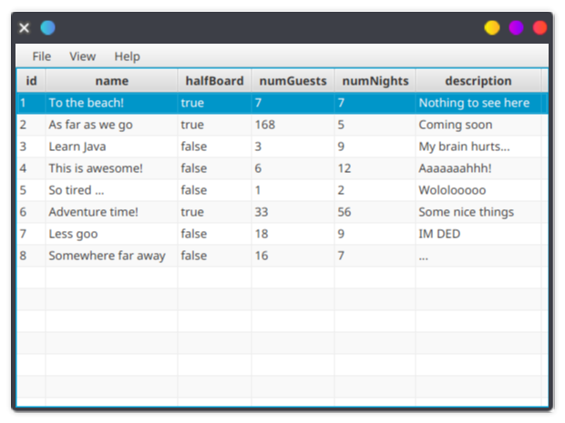
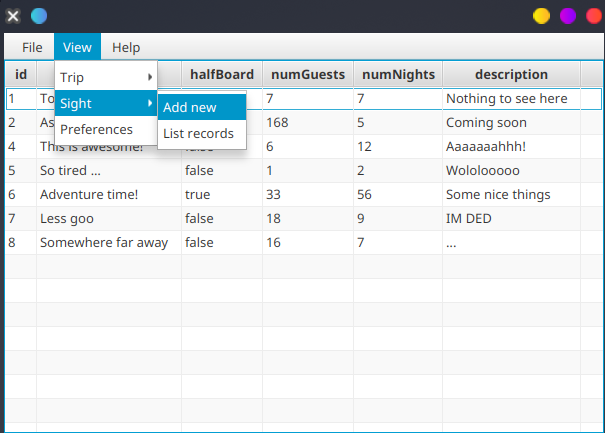
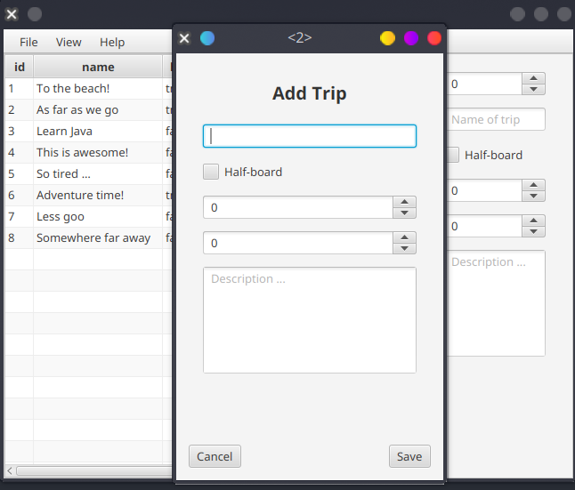
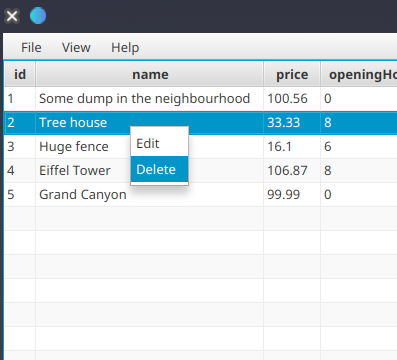
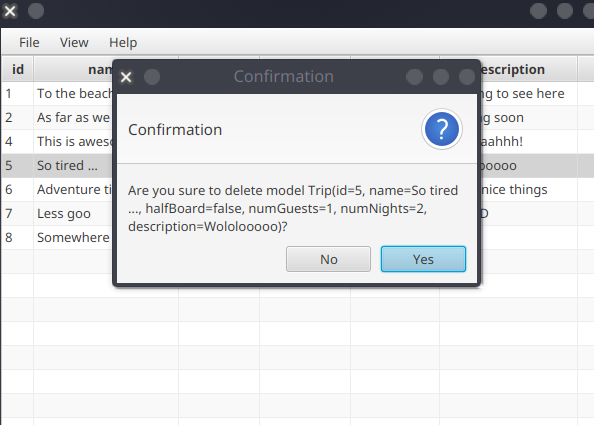

# Desktop FX

Az alkalmazás futtatása előtt nem árt, ha a web szerverünk már fut.
Ennek indítását lásd: [readme](../readme.md).

A desktop alkalmazás egyszerűen futtatható bármely kedvenc fejlesztői környezetünkből,
valamint a tartalmazott `javafx` plugin segítségével is.

Az alkalmazás megnyitása után egy hasonló felülettel fogad minket:

## List

Az oldalsávban található egy szűrő is, melynek segítségével
választott mezőkkel rendelkező rekordokat kérhetünk le.

# Menu

A menüsávból több opció közül is választhatunk rekordjaink kezelésére

## Add

Hozzáadáskor válasszuk ki a megfelelő menüpont alól, az `Add new` funkciót,
és ekkor egy új, felugró ablak fogad majd minket.

Ezen az ablakon is, valamint a továbbiakban is `promptText`, vagy `tooltip`
alapján tájékozódhat a user az adott beviteli mezők funkcionalitását illetően.
Itt tetszés szerinti új rekordokat menthetünk.

## Update

Rekord frissítéskor a jobb egérgombunkkal klikkeljünk a választott rekordra,
majd a felugró ablak segítségével módosítsuk amit csak akarunk.

## Delete

Törlés esetén hasonló módon járjunk el, ekkor pedig `Alert` fogad majd minket,
amely egy igen/nem megerősítő válasz bekérése után, el is végzi a szükséges műveleteket.

## Note

A webszerver újraindításakor minden módosításunk elveszik,
az adatbázis memóriában él, ezáltal kilépéskor törlődni fog.

A desktop alkalmazás pedig evvel a RESTful API-val kommunikál!
